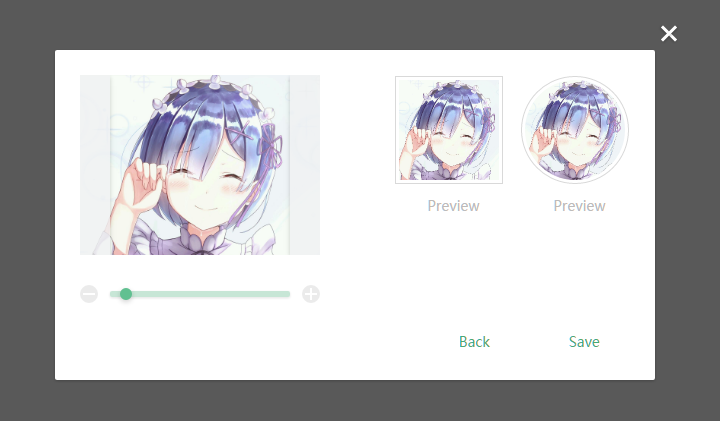
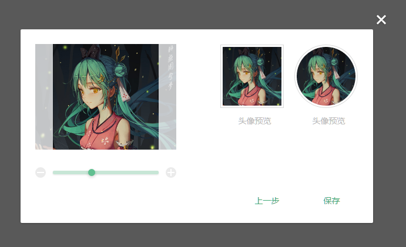

# vue-image-crop-upload

A beautiful vue component for image crop and upload. （vue图片剪裁上传组件）.

**Notice**: This component is designed for pc, **not recommended for use on the mobile side**.(该组件适用于pc端，不推荐手机端使用)

[](https://github.com/dai-siki/vue-image-crop-upload/issues)
[](https://github.com/dai-siki/vue-image-crop-upload/network)
[](https://github.com/dai-siki/vue-image-crop-upload/stargazers)
[](https://twitter.com/intent/tweet?text=Wow:&url=%5Bobject%20Object%5D)

[](https://nodei.co/npm/vue-image-crop-upload/)

## 中文文档在后面

## Change log

#### @2.0.2
- Added the **Dutch** language pack (thanks @blyleven)

#### @2.0.1
- If url prop is empty, the picture will not be uploaded

#### @2.0.0
- Adjust the import mode for different versions of vue, **The default vue version is vue2**
- Added the **French** language pack (thanks @valerymelou)
- Added the **Portuguese (Brazil)** language pack (thanks @abensur)

#### @1.3.5
- Added the **Romanian** language pack (thanks @doriandrn)

#### @1.3.0
- Added the **Russian** language pack (thanks @bigperson)
- Added a new Props: "headers" (Used to set the POST request header)

#### @1.2.0
- Compatible vue2

#### @1.1.0
- Adjusted Props naming: "otherParams"=>"params", "langConf"=>“langExt”
- Optimized language packs


## Demo
[Click me](http://dai-siki.github.io/vue-image-crop-upload/example/demo.html).


## Screenshot


## Brower compatibility
IE10+


## Env
vue@1/vue@2 + webpack + es6


## Install
#### npm
```shell
$ npm install vue-image-crop-upload
```


## Usage
#### Props
| Name              | Type               | Default             | Description                                         |
| ----------------| ---------------- | ---------------| ------------------------------------------|
| url             | String            |  ''                | Server api path,like "/avatar/upload", If empty, will not be uploaded    |
| field       | String   | 'upload'     | Upload input filename, used for server side get the file stream.    |
| value             | Boolean            | twoWay            | show or not    |
| params             | Object            |  null                | POST Params，like "{k:v}"    |
| headers             | Object            |  null                | POST request header，like "{k:v}"    |
| langType             | String            | 'zh'                 | language type    |
| langExt             | Object            |                   | language extend    |
| width             | Number            |   200                | width of receive image     |
| height             | Number            |  200                 | height of receive image   |
| imgFormat             | string            | 'jpg'                  | jpg/png, Server api receive file type.    |
| noCircle | Boolean | false | disable/enable circle preview | 

#### Events
| Name              | Description                                         |
| ----------------| ------------------------------------------|
| cropSuccess   | image crop success, params( imageDataUrl, field )     |
| cropUploadSuccess | upload success, params( jsonData, field )    |
| cropUploadFail    | upload fail, params( status, field )    |

#### Language package
| Support language | Shorthand   | Contributors    |
| ---------------  | ----------- |---------------- |
| 中文（default）    | zh           | dai-siki        |
| English           | en           | dai-siki / doriandrn    |
| Russian           | ru           | bigperson       |
| Romanian          | ro           | doriandrn       |
| Portuguese (Brazil) | pt-br      | abensur       |
| French            | fr           | valerymelou       |
| Dutch             | nl           | blyleven       |

```js
// example
{
    en: {
        hint: 'Click or drag the file here to upload',
        loading: 'Uploading…',
        noSupported: 'Browser is not supported, please use IE10+ or other browsers',
        success: 'Upload success',
        fail: 'Upload failed',
        preview: 'Preview',
        btn: {
            off: 'Cancel',
            close: 'Close',
            back: 'Back',
            save: 'Save'
        },
        error: {
            onlyImg: 'Image only',
            outOfSize: 'Image exceeds size limit: ',
            lowestPx: 'Image\'s size is too low. Expected at least: '
        }
    }
}
```

#### Example vue@2
```html
<div id="app">
	<a class="btn" @click="toggleShow">set avatar</a>
	<my-upload field="img"
        @crop-success="cropSuccess"
        @crop-upload-success="cropUploadSuccess"
        @crop-upload-fail="cropUploadFail"
        v-model="show"
		:width="300"
		:height="300"
		url="/upload"
		:params="params"
		:headers="headers"
		img-format="png"></my-upload>
	
</div>

<script>
	import 'babel-polyfill'; // es6 shim
	import Vue from 'vue';
	import myUpload from 'vue-image-crop-upload';

	new Vue({
		el: '#app',
		data: {
			show: true,
			params: {
				token: '123456798',
				name: 'avatar'
			},
			headers: {
				smail: '*_~'
			},
			imgDataUrl: '' // the datebase64 url of created image
		},
		components: {
			'my-upload': myUpload
		},
		methods: {
			toggleShow() {
				this.show = !this.show;
			},
            /**
			 * crop success
			 *
			 * [param] imgDataUrl
			 * [param] field
			 */
			cropSuccess(imgDataUrl, field){
				console.log('-------- crop success --------');
				this.imgDataUrl = imgDataUrl;
			},
			/**
			 * upload success
			 *
			 * [param] jsonData  server api return data, already json encode
			 * [param] field
			 */
			cropUploadSuccess(jsonData, field){
				console.log('-------- upload success --------');
				console.log(jsonData);
				console.log('field: ' + field);
			},
			/**
			 * upload fail
			 *
			 * [param] status    server api return error status, like 500
			 * [param] field
			 */
			cropUploadFail(status, field){
				console.log('-------- upload fail --------');
				console.log(status);
				console.log('field: ' + field);
			}
		}
	});
</script>
```

#### Example vue@1
```html
<div id="app">
	<a class="btn" @click="toggleShow">set avatar</a>
	<my-upload field="img"
		:width="300"
		:height="300"
		url="/upload"
		:params="params"
		:headers="headers"
        lang-type="en"
		:value.sync="show"
		img-format="png"></my-upload>
	
</div>

<script>
	import 'babel-polyfill'; // es6 shim
	import Vue from 'vue';
	import myUpload from 'vue-image-crop-upload/upload-1.vue';

	new Vue({
		el: '#app',
		data: {
			show: true,
			params: {
				token: '123456798',
				name: 'avatar'
			},
			headers: {
				smail: '*_~'
			},
			imgDataUrl: '' // the datebase64 url of created image
		},
		components: {
			'my-upload': myUpload
		},
		methods: {
			toggleShow() {
				this.show = !this.show;
			}
		},
		events: {
			/**
			 * crop success
			 *
			 * [param] imgDataUrl
			 * [param] field
			 */
			cropSuccess(imgDataUrl, field){
				console.log('-------- crop success --------');
				this.imgDataUrl = imgDataUrl;
			},
			/**
			 * upload success
			 *
			 * [param] jsonData   server api return data, already json encode
			 * [param] field
			 */
			cropUploadSuccess(jsonData, field){
				console.log('-------- upload success --------');
				console.log(jsonData);
				console.log('field: ' + field);
			},
			/**
			 * upload fail
			 *
			 * [param] status    server api return error status, like 500
			 * [param] field
			 */
			cropUploadFail(status, field){
				console.log('-------- upload fail --------');
				console.log(status);
				console.log('field: ' + field);
			}
		}
	});

</script>
```


--------------------------------
# 中文文档

## 更新日志
#### @2.0.0
- 默认支持版本改为vue2，vue1的同学需要引入upload-1.vue

#### @1.3.0
- 添加了新属性: "headers" (用于设置请求头部：setRequestHeader)

#### @1.2.0
- 兼容vue@2版本

#### @1.1.0
- 调整了Props命名: "otherParams"=>"params", "langConf"=>"langExt"

## 示例
[点我](http://dai-siki.github.io/vue-image-crop-upload/example/demo.html).

## 截图


## 浏览器兼容
IE10+


## 配置环境
vue@2（或vue@1） + webpack + es6


## 安装
#### npm
```shell
$ npm install vue-image-crop-upload
```


## 使用
#### Props
| 名称              | 类型               | 默认             | 说明                                         |
| ----------------| ---------------- | ---------------| ------------------------------------------|
| url             | String            |  ''                | 上传接口地址，如果为空，图片不会上传    |
| field       | String   | 'upload'     | 向服务器上传的文件名    |
| value             | Boolean            | twoWay            | 是否显示控件，双向绑定    |
| params             | Object            |  null                | 上传附带其他数据，格式"{k:v}"    |
| headers             | Object            |  null                | 上传header设置，格式"{k:v}"    |
| langType             | String            | 'zh'                 | 语言类型，默认中文    |
| langExt             | Object            |                   | 语言包自行扩展    |
| width             | Number            |   200                | 最终得到的图片宽度     |
| height             | Number            |  200                 | 最终得到的图片高度   |
| imgFormat             | string            | 'jpg'                  | jpg/png, 最终得到的图片格式    |
| noCricle | Boolean | false | 啟用/關閉 圓形預覽 |

#### Events
| 名称              | 说明                                         |
| ----------------| ------------------------------------------|
| cropSuccess   | 图片截取完成事件（上传前), 参数( imageDataUrl, field )     |
| cropUploadSuccess | 上传成功， 参数( jsonData, field )    |
| cropUploadFail    | 上传失败， 参数( status, field )    |

#### 自带语言包
```js
{
    zh: {
        hint: '点击，或拖动图片至此处',
        loading: '正在上传……',
        noSupported: '浏览器不支持该功能，请使用IE10以上或其他现在浏览器！',
        success: '上传成功',
        fail: '图片上传失败',
        preview: '头像预览',
        btn: {
            off: '取消',
            close: '关闭',
            back: '上一步',
            save: '保存'
        },
        error: {
            onlyImg: '仅限图片格式',
            outOfSize: '单文件大小不能超过 ',
            lowestPx: '图片最低像素为（宽*高）：'
        }
    }
}
```

#### 使用示例 vue@1
```html
<div id="app">
	<a class="btn" @click="toggleShow">设置头像</a>
	<my-upload field="img"
		:width="300"
		:height="300"
		url="/upload"
		:params="params"
		:headers="headers"
		:value.sync="show"
		img-format="png"></my-upload>
	
</div>

<script>
	import 'babel-polyfill'; // es6 shim
	import Vue from 'vue';
	import myUpload from 'vue-image-crop-upload/upload-1.vue';

	new Vue({
		el: '#app',
		data: {
			show: true,
			params: {
				token: '123456798',
				name: 'avatar'
			},
			headers: {
				smail: '*_~'
			},
			imgDataUrl: '' // the datebase64 url of created image
		},
		components: {
			'my-upload': myUpload
		},
		methods: {
			toggleShow() {
				this.show = !this.show;
			}
		},
		events: {
            /**
			 * crop success
			 *
			 * [param] imgDataUrl
			 * [param] field
			 */
			cropSuccess(imgDataUrl, field){
				console.log('-------- crop success --------');
				this.imgDataUrl = imgDataUrl;
			},
			/**
			 * upload success
			 *
			 * [param] jsonData   服务器返回数据，已进行json转码
			 * [param] field
			 */
			cropUploadSuccess(jsonData, field){
				console.log('-------- upload success --------');
				console.log(jsonData);
				console.log('field: ' + field);
			},
			/**
			 * upload fail
			 *
			 * [param] status    server api return error status, like 500
			 * [param] field
			 */
			cropUploadFail(status, field){
				console.log('-------- upload fail --------');
				console.log(status);
				console.log('field: ' + field);
			}
		}
	});

</script>
```

#### 使用示例 vue@2
```html
<div id="app">
	<a class="btn" @click="toggleShow">设置头像</a>
	<my-upload field="img"
        @crop-success="cropSuccess"
        @crop-upload-success="cropUploadSuccess"
        @crop-upload-fail="cropUploadFail"
        v-model="show"
		:width="300"
		:height="300"
		url="/upload"
		:params="params"
		:headers="headers"
		img-format="png"></my-upload>
	
</div>

<script>
	import 'babel-polyfill'; // es6 shim
	import Vue from 'vue';
	import myUpload from 'vue-image-crop-upload';

	new Vue({
		el: '#app',
		data: {
			show: true,
			params: {
				token: '123456798',
				name: 'avatar'
			},
			headers: {
				smail: '*_~'
			},
			imgDataUrl: '' // the datebase64 url of created image
		},
		components: {
			'my-upload': myUpload
		},
		methods: {
			toggleShow() {
				this.show = !this.show;
			},
            /**
			 * crop success
			 *
			 * [param] imgDataUrl
			 * [param] field
			 */
			cropSuccess(imgDataUrl, field){
				console.log('-------- crop success --------');
				this.imgDataUrl = imgDataUrl;
			},
			/**
			 * upload success
			 *
			 * [param] jsonData   服务器返回数据，已进行json转码
			 * [param] field
			 */
			cropUploadSuccess(jsonData, field){
				console.log('-------- upload success --------');
				console.log(jsonData);
				console.log('field: ' + field);
			},
			/**
			 * upload fail
			 *
			 * [param] status    server api return error status, like 500
			 * [param] field
			 */
			cropUploadFail(status, field){
				console.log('-------- upload fail --------');
				console.log(status);
				console.log('field: ' + field);
			}
		}
	});

</script>
```
